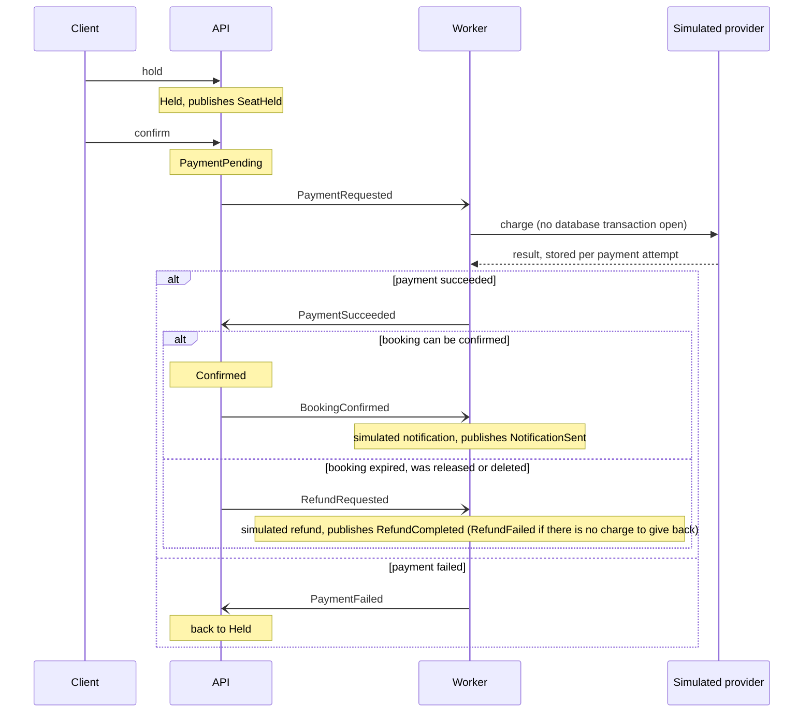

# SeatHive - Ticket Booking Backend

[](https://github.com/wingtion/SeatHive/actions/workflows/ci.yml)

SeatHive is a .NET backend for booking event seats. Its main job is to make sure that when many requests try to book the same seat at the same time, exactly one of them gets it.

This is a portfolio project. It is not deployed anywhere yet; see the [Roadmap](#roadmap) for what is still missing.

## Architecture

Two services and a shared contract library:

*   **API Service:** Handles HTTP requests, authentication and the booking logic. It also consumes the payment results.
*   **Worker Service:** Simulates what happens outside the booking system: the payment, the refund and the notification. Nothing real happens there: no money moves and no email is sent, and its log lines and events say so.
*   **Shared Library:** Contains the event contracts used by both services.

## Key Features

*   **Concurrency Control:** A seat booking is protected by two layers.
    1.  A Redis lock per seat: acquired with `SET NX` and a TTL, storing a random token. It is released by a Lua script that deletes the key only if it still holds that token, so a request can never release a lock it does not own.
    2.  A partial unique index in PostgreSQL: every booking is a row in the `Bookings` table, and the index allows at most one active (`Held`, `PaymentPending` or `Confirmed`) booking per seat. A hold is inserted with `ON CONFLICT ... DO NOTHING` on that index: a second one for the same seat inserts nothing and the booking is rejected with `seat_held`. Losing that race is an answer, not an error, so no database command fails and nothing is logged as a failure.

    This is not Redlock. Redlock coordinates locks across several independent Redis nodes; SeatHive runs a single Redis instance, and the database index is what finally guarantees correctness even if the lock fails or expires.

    If Redis cannot be reached, holds go on without the lock and a warning is logged: the database alone decides, still one hold per seat, and a request that loses gets `seat_held` instead of `seat_locked`. The API does not wait for a Redis that is down: it starts without it, a lock request fails at once while there is no connection and gives up after a second without an answer, and the lock is used again as soon as Redis is back. Releasing a lock is best effort; a lock that could not be released runs out after 10 seconds.
*   **Booking Model:** A seat has no "booked" flag; whether it is taken follows from its bookings. A booking has a status (`Held`, `PaymentPending`, `Confirmed`, `Expired`, `Released`) and timestamps. In JSON every enum value is a camelCase string: `held`, `paymentPending`, `confirmed`, `expired`, `released`.
*   **Hold → Pay → Confirm Flow:** A seat is first held, then paid for, then confirmed.
    1.  **Hold:** creates a `Held` booking that expires after a configurable time (5 minutes by default). Holding a seat you already hold returns the same hold and does not extend it. A user can hold at most 4 seats at the same time (configurable); a booking waiting for its payment counts as one of them.
    2.  **Confirm:** only the owner can confirm, and only before the hold expires. Confirming starts the payment: the booking becomes `PaymentPending` and the API answers `202`. Confirming again while the payment is running changes nothing.
    3.  **Payment result:** the Worker reports the result as an event. On success the booking becomes `Confirmed`. On failure it goes back to `Held` with its original deadline, so the owner can confirm again while the hold lasts.
    4.  **Release:** the owner can give a hold up (`Held` → `Released`); the seat is free again at once. A booking whose payment is running cannot be released.
*   **Simulated Payment:** There is no real payment provider. The Worker's stand-in takes 1 to 3 seconds and fails at a configurable rate (20% by default); a confirm request can also force its payment to fail, for demos.
    *   The call to the provider runs without an open database transaction. Recording and announcing its answer is a separate, short transaction.
    *   The provider charges once per payment attempt: the attempt's id is its idempotency key, so a payment request that is delivered again gets the first answer back instead of a second charge. Every confirm starts a new attempt.
    *   The result of a charge is announced once: the charge records when it was announced, with a conditional update in the transaction the announcement is stored in. A second outcome for the same charge, at the same moment or as a separate message, announces nothing.
    *   The provider keeps a charge for 7 days after its result was announced (configurable); a background service deletes older ones every hour. A charge whose result has not been announced yet is never deleted.
*   **Refunds:** When a payment succeeds but its booking cannot be confirmed (it expired, was released, or was deleted by a reset of the demo data), the API asks for a refund and the Worker simulates it.
    *   A charge is refunded once: the charge records when it was given back, with a conditional update, and only the request that changes it publishes `RefundCompleted`. Another request for the same payment does nothing.
    *   If the provider has no successful charge for the payment, nothing is refunded and the Worker publishes `RefundFailed` (`charge_not_found` or `charge_not_successful`) instead; it shows up in the booking's history as `refundFailed`. This is also what happens to a refund asked for after the charge was deleted, more than 7 days after its result was announced.
*   **Hold Expiry:** A hold whose time has run out stops counting immediately: it cannot be confirmed and does not count towards the user's limit. It is marked `Expired` in two ways: lazily, when someone tries to hold that seat, inside the same transaction as the new hold; and by a background service that sweeps expired holds every 5 seconds (configurable). A booking waiting for its payment result is kept for a grace period after its hold ran out (30 seconds, configurable), so a payment made in time is not lost because its result arrived a moment late. Every status change is a single conditional update, so of a confirm, a payment result and an expiry only one can win for a given booking.
*   **Error Responses:** Errors are `application/problem+json` with a machine-readable `code`:
    *   Seats: `seat_not_found` (404), `seat_already_booked` (409, the seat has a confirmed booking), `seat_held` (409, another user holds the seat), `seat_locked` (409, another request is working on that seat right now).
    *   Holds: `hold_limit_reached` (409), `hold_expired` (410), `hold_not_active` (409, confirming a released hold or releasing a booking that is not a hold), `payment_in_progress` (409, releasing a booking whose payment is running), `booking_not_found` (404), `not_hold_owner` (403).
    *   Events: `event_not_found` (404).
    *   Race simulation: `seat_held_by_race` (409, the winner of an earlier race still holds the seat; the body has `releasesAt`), `race_in_progress` (409, another race is running), `racers_busy` (409, too few racers are free).
    *   General: `validation_failed` (400), `invalid_token` (401), `email_already_registered` (409), `invalid_credentials` (401). Errors that no endpoint produces itself have a body too: `unauthorized` (401, no or an invalid token), `forbidden` (403, wrong role), `rate_limited` (429), `internal_error` (500, an unexpected error; what went wrong is only in the log, not in the response).
*   **Messaging:** The services talk through events on **RabbitMQ (MassTransit)**. Every event carries the booking id, the seat, the user and a timestamp.
    *   Transactional outbox: a booking change and the event that announces it are written in one database transaction, and the event is sent to RabbitMQ afterwards. An event is never lost, and never sent for a change that was rolled back.
    *   Inbox: a message that is delivered twice is consumed once. The one exception is the Worker's call to the payment provider, which is safe to repeat because of the idempotency key.
    *   The inbox needed a fix to keep that promise. MassTransit (8.5.11) adds the inbox row in one transaction and runs the consumer in a later one, on the same `DbContext`; EF Core does not refresh an entity it already tracks, so when the same message arrived twice at the same moment, one delivery could miss that the other had consumed it and run the consumer again (about one in fifteen such pairs). Both services now forget the tracked inbox rows whenever a transaction ends (`InboxStateDetachInterceptor`), so the row is always read from the database under its lock. Payment results and refunds do not rely on this alone; see above.
    *   The Worker keeps its inbox, outbox and the provider's charges in its own schema (`worker`) of the same database.
*   **Authentication and Roles:** **JWT** authentication with two roles, `User` and `Admin`. Resetting the demo data is Admin only; the race simulation is open to every signed-in user. The admin account is created at startup from environment variables; without them no admin exists. A third role, `Racer`, belongs to the simulation's racer accounts, which nobody can sign in as.
*   **Input Validation:** Registration requires a valid email and a password of at least 8 characters and at most 72 bytes. Emails are stored in lowercase and are unique. Emails at `racers.seathive.invalid` are refused: they belong to the racers.
*   **Read Endpoints:** Events and their seats can be read without a token; a user's own bookings need one. Lists are paged (`page`, `pageSize`); a page size over the maximum (100, for seats 500) is rejected with `400`, not cut down. A seat is `available`, `held` or `booked`, with `heldUntil` while it is held. The seat response never says who holds a seat or which booking it is. A booking can only be read by its owner; for anyone else, admins included, it is `403` `not_hold_owner`.
*   **Booking History:** `GET /api/booking/{id}/history` returns what happened to a booking: hold, payment requests and results, confirmation, notification, release, expiry, refund (completed or failed).
    *   Every row comes from an event that went through the outbox and the bus; nothing is generated for display. A change that was rolled back leaves no row. Events from before this feature existed are not filled in afterwards.
    *   A row is written in the same database transaction as the inbox record of its message, and the event id (the message id) is unique, so an event that is delivered twice is recorded once, also after the inbox has forgotten the message.
    *   The order is the time the event itself carries (`occurredAt`), not the time it was recorded. Events with the same timestamp follow the life cycle of a booking (a request before its result), and after that the `sequence` number, which is the order of recording. The API and the Worker each use their own clock; on one machine that is the same clock.
    *   Payments, refunds and notifications are marked `"simulated": true`.
    *   The history lags behind the change by the delivery delay of the outbox (about a second). Only the owner can read it, like the booking itself.
*   **Live Updates:** A SignalR hub at `/hubs/seats` sends four messages. Clients only listen; nothing sent to the hub changes a booking.
    *   `seatStatusChanged` `{ eventId, seatId, status, heldUntil }` goes to everyone watching an event (call `JoinEvent(eventId)`, and `LeaveEvent(eventId)` to stop). `JoinEvent` answers `{ joined, error }`: for an event that does not exist, `joined` is `false` and `error` is `event_not_found`. Like the seat endpoint, it never says who holds a seat.
    *   `bookingEvent` goes to the owner of a booking, on all their connections, for every event of the booking. It has the fields of a history item plus `bookingId`, and the same `eventId`, so a client can merge the two.
    *   `demoDataReset` goes to everyone when the demo data was reset: read everything again.
    *   `raceFinished` goes to everyone watching an event when a race of the simulation on one of its seats is over. It is the same report the starter of the race got back (see Concurrency Simulation).
    *   Nothing is sent from the request that made the change. Every message starts as an event in the outbox and is sent when that event comes back over the bus, so a change that was rolled back is never announced. Updates therefore follow the change by the delivery delay of the outbox (about a second).
    *   A seat update does not repeat what the event said: it reads the seat's current state and sends that, one update at a time, so an event that arrives late, out of order or twice cannot announce a state the seat is no longer in. A `bookingEvent` may be sent again after a failure; its `eventId` tells a client it has it already.
    *   A hold that runs out is announced when the sweeper marks it (every 5 seconds); until then a client can count down `heldUntil` itself.
    *   The hub needs a token. A browser cannot set a header on a WebSocket, so the SignalR client sends the token as the `access_token` query parameter; it is accepted there for the hub only. A connection is closed when its token runs out. Joining is only possible for an event that exists.
    *   One API instance is assumed. With several, each event would reach only one of them (they would share the queue), and clients connected to the others would miss it; that needs a SignalR backplane (Redis) first.
*   **Rate Limiting:** Register and login are limited to 10 requests per minute per IP address, the booking endpoints (hold, confirm and release together) to 30 requests per minute per user, and the read endpoints to 120 requests per minute per user (per IP address without a token), counted separately so reading never uses up the booking limit. The race simulation is limited to 5 races per minute per user, and one race runs at a time. Requests over the limit get `429`.
*   **Behind a Reverse Proxy:** The limits per IP address need the client's address. `X-Forwarded-For` and `X-Forwarded-Proto` are believed only when the request comes from a configured proxy (`ReverseProxy:TrustedProxies`, addresses or networks), and only the last hop counts. With nothing configured they are ignored. Docker Compose gives Caddy, the reverse proxy, a fixed address and the API trusts that address only.
*   **Browser Access (CORS):** A page on another origin (the front end) can call the API and connect to the hub only from an origin listed in `Cors:AllowedOrigins`. Each entry is an exact origin such as `https://seathive.example`; `*`, a path or a trailing `/` stops the API from starting. Credentials are allowed, with the methods `GET` and `POST` and the headers `Authorization`, `Content-Type`, `X-Requested-With` and `X-SignalR-User-Agent`. CORS does not cover the WebSocket handshake, so the same list is checked there too: a handshake from another origin gets `403`. With no origin configured CORS is off.
*   **Configuration:** Secrets (JWT key, database, Redis and RabbitMQ credentials) are not in the repository. The API and the Worker do not start if one is missing.
*   **Containerization:** **Docker Compose** runs the API, Worker, Postgres, Redis and RabbitMQ, and on a server Caddy as the HTTPS reverse proxy in front of the API. The API and the Worker each apply their own database migrations when they start.

## Event Flow



Releasing a hold publishes `HoldReleased`, and a hold that runs out publishes `HoldExpired`. Resetting the demo data publishes `DemoDataReset`.

The API also consumes the booking events itself, on three queues of its own: `booking-history` writes each event into the booking's history, `seat-status-broadcast` tells everyone watching the event that the seat changed, and `booking-live` tells the booking's owner.

## Tech Stack

*   **.NET 10 Web API**
*   **PostgreSQL 16** (EF Core migrations)
*   **Redis 8.10** (StackExchange.Redis)
*   **RabbitMQ 4.3** (MassTransit)
*   **xUnit, Moq & Testcontainers**
*   **Docker & Docker Compose**
*   **Caddy 2.11** (reverse proxy, HTTPS)

## How to Run

1.  **Clone the repo:**
    ```bash
    git clone https://github.com/wingtion/SeatHive.git
    cd SeatHive
    ```

2.  **Create your `.env` file:**
    ```bash
    cp .env.example .env
    ```
    Fill in every value in `.env` (for example with `openssl rand -hex 32`). The file explains each one. Set `SEATHIVE_ADMIN_EMAIL` and `SEATHIVE_ADMIN_PASSWORD` if you want an admin account. `.env` is ignored by git.

3.  **Start everything:**
    ```bash
    docker compose up -d --build
    ```
    This runs the API in the Development environment and publishes the API (`8080`) and the Postgres, Redis and RabbitMQ ports on `127.0.0.1` for local development (`docker-compose.override.yml`); a front end on `http://localhost:5173` may call the API. The reverse proxy (Caddy) does not run locally unless asked for; to try it on `https://localhost` (Caddy's own local certificate), add `--profile proxy` (ports 80 and 443 must be free).

    On a server, use only the main file:
    ```bash
    docker compose -f docker-compose.yml up -d --build
    ```
    Caddy is then the only thing reachable from outside (ports 80 and 443): it terminates HTTPS, with a Let's Encrypt certificate for the domain in `SITE_ADDRESS`, and forwards to the API. The API, Postgres, Redis and RabbitMQ (its management UI included) publish no port. The API runs in the Production environment. Set `SITE_ADDRESS` and `CORS_ALLOWED_ORIGIN` in `.env`; see Deployment Notes.

4.  **Access Swagger:**
    Navigate to `http://localhost:8080/swagger`. Swagger is only enabled in the Development environment, so it is there with `docker compose up` on your machine and not on a server started with the main file only.

## Using the API

1.  **Register:** `POST /api/auth/register`
2.  **Login:** `POST /api/auth/login` -> Copy Token (valid for 2 hours).
3.  **Authorize:** Click the lock icon in Swagger -> Paste the token only (Swagger adds `Bearer` itself).
4.  **Create demo data (Admin):** `POST /api/setup/create-data`. Log in with the admin account from your `.env` first. This recreates one event with 100 seats, with seat ids starting at 1 again; users are kept. All bookings and their history are deleted, but booking ids are not reused.
5.  **Look around (no token needed):** `GET /api/events`, `GET /api/events/{id}` and `GET /api/events/{id}/seats`. A list answers `{ "items", "page", "pageSize", "totalCount" }`; a seat is `{ "seatId", "section", "row", "seatNumber", "status", "heldUntil" }`.
6.  **Hold:** `POST /api/booking/hold` with `{ "seatId": 5 }` (requires a token). Returns `{ "bookingId", "seatId", "status": "held", "expiresAt" }`.
7.  **Confirm:** `POST /api/booking/{bookingId}/confirm` before `expiresAt`. Returns `202` with `{ "bookingId", "seatId", "status": "paymentPending", "confirmedAt": null }`; the booking is confirmed a few seconds later, when the payment result arrives. Calling it again then returns `200` with `"status": "confirmed"`. After the hold has expired it returns `410` with `hold_expired`. Send the body `{ "simulatePaymentFailure": true }` to make this payment fail. The Worker log shows the payment and the notification.
8.  **Or release:** `POST /api/booking/{bookingId}/release` gives the hold up. Returns `{ "bookingId", "seatId", "status": "released" }`.
9.  **Read your bookings:** `GET /api/booking` (paged, newest first) and `GET /api/booking/{bookingId}`. Each has the status, the timestamps, the seat and the event.
10. **Read what happened to it:** `GET /api/booking/{bookingId}/history` (paged). Each item is `{ "eventId", "sequence", "type", "occurredAt", "paymentId", "detail", "simulated" }`, with types such as `seatHeld`, `paymentRequested`, `paymentSucceeded`, `bookingConfirmed` and `notificationSent`.

Settings:

*   API, section `Holds`: `DurationSeconds` (300), `MaxActivePerUser` (4), `PaymentGraceSeconds` (30) and `SweepIntervalSeconds` (5).
*   API, section `RateLimiting`: `Auth:PermitLimit` (10), `Booking:PermitLimit` (30), `Read:PermitLimit` (120) and `Simulation:PermitLimit` (5), each per minute.
*   API, section `Simulation`: `WinnerHoldSeconds` (10), how long the winner of a race keeps the seat.
*   API, `ReverseProxy:TrustedProxies`: a list of addresses or networks; empty by default. Docker Compose sets it to Caddy's fixed address (`CADDY_IP` in `.env`, `172.28.0.10` by default).
*   API, `Cors:AllowedOrigins`: a list of origins; empty by default, which turns CORS off. In the Development environment it is `http://localhost:5173` (`appsettings.Development.json`, and `docker-compose.override.yml` for compose). On a server Docker Compose sets it from `CORS_ALLOWED_ORIGIN` in `.env`.
*   Worker, section `Payment`: `FailureRate` (0.2), `MinDelayMs` (1000), `MaxDelayMs` (3000), `ChargeRetentionDays` (7) and `CleanupIntervalMinutes` (60).

## Deployment Notes

Nothing is deployed yet. The main compose file is ready for a server; what it already takes care of:

*   **HTTPS through Caddy** (`caddy/Caddyfile`). Caddy terminates TLS (certificates from Let's Encrypt, renewed by itself), redirects HTTP to HTTPS, serves HTTP/3, and forwards everything to the API, WebSockets included. It forwards to the API only.
*   **Only Caddy is reachable.** On a server only ports 80 and 443 are published. The API, Postgres, Redis and RabbitMQ, its management UI (15672) included, publish nothing and are reachable from inside the compose network only. A test reads the compose files the way Docker Compose does and checks this.
*   **The token is masked in the access log.** A WebSocket connection to the hub carries the JWT in the address (`/hubs/seats?access_token=...`), where it stays valid for up to 2 hours. Caddy's access log replaces it with `REDACTED`; it leaves out `Authorization` and `Cookie` headers by itself.
*   **Forwarded headers from the proxy only.** Caddy has a fixed address (`CADDY_IP`), and the API believes `X-Forwarded-For` and `X-Forwarded-Proto` from that one address only. Caddy itself ignores what a client sends in `X-Forwarded-For`, so the limits per IP address count the real client.
*   **Pinned images**, the same Postgres and Redis versions the tests run.

What is still to do on the server itself:

*   **A domain and open ports.** Point a DNS record at the server, open ports 80 and 443 (Let's Encrypt needs both), and set `SITE_ADDRESS` to that domain.
*   **Name the front end's origin.** Set `CORS_ALLOWED_ORIGIN` to the production origin of the front end only (`https://...`, no trailing `/`), not to preview deployments. Without it browsers on other origins cannot call the API.
*   **Start the main compose file only.** It runs the API in the Production environment: no Swagger, no Development settings (such as the `localhost` origin) and no published infrastructure ports.
*   **One API instance.** See Live Updates above for why more need a backplane.

What was checked by hand, with the main compose file and Caddy on `https://localhost`: only ports 80 and 443 are open; HTTP is redirected to HTTPS; RabbitMQ's management UI cannot be reached through Caddy, not even with its own host name; a WebSocket to the hub works through Caddy and gets `raceFinished`; the payment flow runs over RabbitMQ 4.3; the token does not appear in Caddy's log and `access_token=REDACTED` does; and eleven logins, each with a different invented `X-Forwarded-For`, still hit the per-address limit on the eleventh.

## Concurrency Simulation

`POST /api/simulation/simulate-concurrency` (any signed-in user) starts a race: racers try to hold one seat at the same moment, and exactly one may get it. The body is optional: `{ "seatId": 5, "racers": 20 }`. Without a seat the race takes the free seat with the lowest id; `racers` is 2 to 50, 20 by default.

*   **Racers are users of their own.** There are 50 racer accounts (`racer-01` to `racer-50` at `racers.seathive.invalid`, role `Racer`), created on the first race. Nobody can sign in as one (the password hash is made from a secret that is thrown away) or register one. A race picks the racers that hold nothing, at random, so none can lose for a reason that has nothing to do with the seat (its hold limit).
*   **They really race.** Each racer has its own scope and database connection, like a request of its own, and calls the same `HoldSeatAsync` the hold endpoint uses: the Redis lock, the transaction and the unique index. All racers wait at a start line until every one is there, then go at once. They call the booking service directly, not the HTTP endpoint, so token checks and rate limits are not part of the race; the guarantee is not in those.
*   **Every attempt is reported.** The answer is `{ raceId, eventId, seatId, racers, winners, startedAt, durationMs, winner, attempts }`. Each attempt has the racer's number, `outcome` (`won`, `rejected`, or `error` if something else failed), the error `code` of a rejection (`seat_locked`: another racer had the lock; `seat_held`: it got the lock or went without it, and the database said the seat was taken), `lock` (`acquired`, `busy`, or `unavailable` when Redis could not be asked) and when it started and finished, in milliseconds since the start. What happened at the lock is measured in the hold itself, not guessed from the code. No user id or email is shown. Everyone watching the event gets the same report as `raceFinished`.
*   **The winner keeps the seat for 10 seconds** (`Simulation:WinnerHoldSeconds`) so the hold can be seen, then gives it up through the normal release, which publishes `HoldReleased`. While it holds the seat, a new race on that seat is refused with `seat_held_by_race` and the time it comes free, instead of reporting a race nobody could win. The release is scheduled in the API's memory: if the API restarts first, or the release fails, the hold runs out after its normal duration (5 minutes) and the sweeper frees the seat.
*   **A race does not start** on a seat that is taken (`seat_held`, `seat_already_booked`), while another race runs (`race_in_progress`), or when too few racers are free (`racers_busy`). If a real user takes the seat during the race, the report honestly says that nobody won.
*   **With Redis down** every attempt reports `lock: unavailable`, and the database alone decides: still one winner, everyone else `seat_held`.

## Tests

```bash
dotnet test
```

The tests need a running Docker daemon, because the integration tests start a real PostgreSQL and a real Redis with Testcontainers. They take both images from `docker-compose.yml`, so they test the versions a server runs. RabbitMQ is replaced by MassTransit's in-memory transport; the outbox and inbox run on the real database. RabbitMQ itself (4.3) is only checked by hand against the running containers.

The two containers are started once per run. The test classes are grouped into collections that run in parallel, each on a database of its own on that one PostgreSQL server (and a Redis database of its own). Most API tests get their user written straight to the database with a token signed by the test key; registering and logging in for real is kept for the registration, access and end to end tests.

Every test has a category, so a part of the suite can be run on its own:

```bash
dotnet test --filter "Category=Integration"   # a service or the schema on the database, no API host
dotnet test --filter "Category=Api"           # the API in-process, over HTTP
dotnet test --filter "Category=E2E"           # the API and the Worker's consumers together
```

There are no unit tests: every test needs Docker.

*   **Booking service (Testcontainers):** the service on a real database, partly with a mocked lock and message bus: for example that a lock which was not acquired is never released, and that each step (hold, payment request, confirmation) publishes its event once.
*   **Hold flow (Testcontainers):** the same user holding a seat twice gets the same hold; another user can take a seat once its hold has run out, without the sweeper; confirming or releasing someone else's hold is rejected; an expired hold cannot be confirmed; the per-user limit; the sweep expires only holds that ran out. Time comes from a fake clock that the tests advance, so nothing waits for time to pass. The hold sweeper's timer loop itself is not tested, only the expiry it calls.
*   **Payment flow (Testcontainers):** a successful payment confirms the booking; a failed one returns it to a hold that can be paid again; a result for an earlier attempt does not touch the current one; a payment that succeeds after the booking expired, was released or was deleted is refunded; a result inside the grace period still confirms.
*   **Outbox and inbox (API on the in-memory bus):** an event is delivered when its transaction commits and not when it is rolled back; the same message delivered twice confirms and announces once.
*   **Worker:** the simulated provider returns the first result for a repeated key and charges once when the same key arrives twice at the same moment; the same payment request delivered twice produces one charge and one result; the provider call runs without an open database transaction (checked in PostgreSQL's `pg_stat_activity` while a fake clock holds the payment); charges whose result was announced longer ago than the retention period are deleted, including by the background service's own loop, and a charge whose result is not announced yet is kept.
*   **Worker, the same message twice at the same moment:** the same payment outcome, the same refund request and the same confirmation are each sent twice at once, 100 times, on a Worker that is already running; every pair must produce one result and send it once. A second, separate message about the same charge announces or refunds nothing more. A refund without a charge, or for a charge that failed, ends in `RefundFailed`.
*   **End to end (API and Worker consumers on one in-memory bus):** hold → confirm → `Confirmed` and `NotificationSent`; a forced payment failure and a retry; a refund for a payment that came too late; and again that no transaction is open while the payment is at the provider.
*   **Concurrency (Testcontainers):** 20 concurrent users holding the same seat, repeated for 25 rounds, must produce exactly one hold each round. One user holding 10 seats at once must end up with exactly 4. A confirm racing the sweeper, and a payment result racing the sweeper, must each end in one outcome, never mixed. Further tests check that a lock can only be released by its owner, and that the database rejects a second active booking for the same seat even with the lock disabled.
*   **Without Redis:** with Redis unreachable, 20 concurrent users holding the same seat, for 25 rounds, still produce exactly one hold each round, and every other user gets `seat_held`, without a single failed database command (counted by an EF Core interceptor, with and without Redis). Asking for a lock fails within two seconds, a lock whose release fails does not turn into an error, and the API starts and takes holds without Redis. Redis being stopped and started again while the API runs was checked by hand against the containers.
*   **Authorization and API (WebApplicationFactory):** the real API runs in-process and is checked for role access (401/403), status codes and error codes, validation (400), duplicate emails, rate limiting (429), an unexpected error (500 with `internal_error` and no details), startup configuration, and that a reset of the demo data does not reuse booking ids.
*   **Read endpoints (WebApplicationFactory):** events and seats are readable without a token; a seat follows its booking (`available`, `held`, `booked`, also for a hold that ran out and was not swept yet); the seat response has exactly its six fields and nothing about the holder; paging limits are rejected with `400`; a booking is `403` for another user and for an admin; reads have their own rate limit.
*   **Live updates (API and Worker consumers on one in-memory bus, a SignalR client over long polling):** connecting without a token or with an expired one is rejected; a token in the query string is accepted by the hub and nowhere else; joining an event that does not exist is answered with `event_not_found`; a watcher of an event sees a seat become held, available and booked, and available again when the hold runs out; the seat message has exactly its four fields; watchers of another event, of nothing, or who left get nothing; a rolled back change is not announced; the owner gets every event of the booking on all connections and another user gets none; a reset reaches every connection. The WebSocket transport itself and closing a connection when its token runs out are not covered by a test.
*   **Booking history (API and Worker consumers on one in-memory bus):** a successful booking, a failed payment with a retry, a release, an expiry and a refund each leave their events in order; an event that happened earlier but arrived later is listed earlier; the same event delivered twice, or again after the inbox forgot it, is one row; when marking the message as consumed fails, the row is rolled back with it; a rolled back change leaves no row; another user and an admin get `403`.
*   **Race simulation (WebApplicationFactory, a SignalR client over long polling):** any signed-in user can race, nobody without a token; 20 racers by default, each a different racer, exactly one winner, and every loser either `seat_locked` with the lock `busy` or `seat_held` with the lock `acquired`; with Redis unreachable every lock is `unavailable` and there is still one winner; races one after another each have a winner; the winner's hold is still there one second before its time (the test moves the clock) and released through `HoldReleased` at its time, also with another configured time; a race on a seat whose winner still holds it is refused with `seat_held_by_race` and its `releasesAt`, and allowed again after the release; a seat that is held, booked or missing, too few or too many racers, too few free racers, a second race while one is running (the first is stopped at the lock by the test) and the per-user limit are each refused with their code; racer accounts cannot sign in or be registered; watchers of the event get `raceFinished` with the same attempts, watchers of another event nothing. A race against the running containers was also checked by hand: 1 winner, 19 losers at the lock, release after 10 seconds, and with Redis stopped 19 losers at the database.
*   **Forwarded headers:** behind a trusted proxy each client address gets its own limit; a forwarded address from anyone else, or one a client put in front of the proxy's, is ignored.
*   **What a server exposes:** the compose files as Docker Compose reads them (`docker compose config`): on a server only Caddy publishes ports (80, 443/tcp, 443/udp), nothing publishes 8080, 5432, 6379, 5672 or 15672; Caddy forwards to `api:8080` only, and the API trusts Caddy's address only; locally everything but Caddy is published on `127.0.0.1` only. Caddy itself (TLS, the masked log, the WebSocket) is not run by the tests; see Deployment Notes for what was checked by hand.
*   **CORS:** a preflight from a configured origin (for the events, the hold and the hub's negotiate) names that origin and allows credentials, never `*`; another origin gets no CORS headers; only `GET` and `POST` are allowed; with no origin configured CORS is off; the Development settings allow `http://localhost:5173` and Production does not; an invalid origin (`*`, a wildcard, a path, a trailing `/`, another scheme) stops the API from starting. That the WebSocket handshake refuses another origin is not tested (the test server skips that check), only that the list is configured; it was checked by hand against the running containers.
*   **Swagger:** the document is served in Development only, and only the endpoints that need a token are marked with the bearer scheme.
*   **Migrations:** every integration test runs on a schema built by the EF Core migrations, and one test upgrades a database from the first migration.

## Roadmap

Done:

*   [x] Seat holds with expiry.
*   [x] Simulated payment between hold and confirmation, with refunds.
*   [x] Transactional outbox and inbox.
*   [x] Read endpoints for events, seats and bookings.
*   [x] The event history of a booking.
*   [x] Live updates with SignalR.
*   [x] CORS for a browser front end.
*   [x] A race simulation with real racers, a report of every attempt and a live broadcast.

Not implemented yet:

*   [ ] A hosted live demo. The compose files and the reverse proxy are ready; a server, a domain and the front end are not (see the deployment notes).
