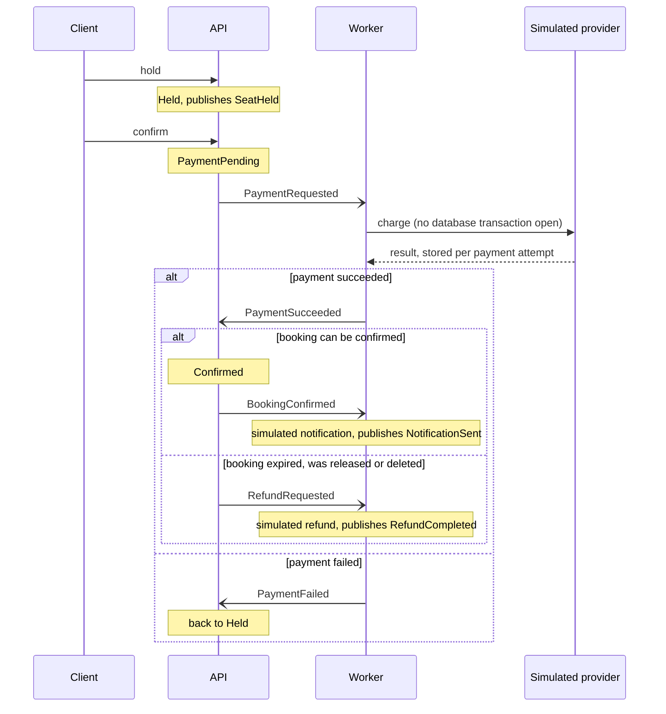

# SeatHive - Ticket Booking Backend

[](https://github.com/wingtion/SeatHive/actions/workflows/ci.yml)

SeatHive is a .NET backend for booking event seats. Its main job is to make sure that when many requests try to book the same seat at the same time, exactly one of them gets it.

This is a portfolio project. It is not deployed anywhere yet; see the [Roadmap](#roadmap) for what is still missing.

## Architecture

Two services and a shared contract library:

*   **API Service:** Handles HTTP requests, authentication and the booking logic. It also consumes the payment results.
*   **Worker Service:** Simulates what happens outside the booking system: the payment, the refund and the notification. Nothing real happens there: no money moves and no email is sent, and its log lines and events say so.
*   **Shared Library:** Contains the event contracts used by both services.

## Key Features

*   **Concurrency Control:** A seat booking is protected by two layers.
    1.  A Redis lock per seat: acquired with `SET NX` and a TTL, storing a random token. It is released by a Lua script that deletes the key only if it still holds that token, so a request can never release a lock it does not own.
    2.  A partial unique index in PostgreSQL: every booking is a row in the `Bookings` table, and the index allows at most one active (`Held`, `PaymentPending` or `Confirmed`) booking per seat. A second insert for the same seat fails and the booking is rejected.

    This is not Redlock. Redlock coordinates locks across several independent Redis nodes; SeatHive runs a single Redis instance, and the database index is what finally guarantees correctness even if the lock fails or expires.
*   **Booking Model:** A seat has no "booked" flag; whether it is taken follows from its bookings. A booking has a status (`Held`, `PaymentPending`, `Confirmed`, `Expired`, `Released`) and timestamps.
*   **Hold → Pay → Confirm Flow:** A seat is first held, then paid for, then confirmed.
    1.  **Hold:** creates a `Held` booking that expires after a configurable time (5 minutes by default). Holding a seat you already hold returns the same hold and does not extend it. A user can hold at most 4 seats at the same time (configurable); a booking waiting for its payment counts as one of them.
    2.  **Confirm:** only the owner can confirm, and only before the hold expires. Confirming starts the payment: the booking becomes `PaymentPending` and the API answers `202`. Confirming again while the payment is running changes nothing.
    3.  **Payment result:** the Worker reports the result as an event. On success the booking becomes `Confirmed`. On failure it goes back to `Held` with its original deadline, so the owner can confirm again while the hold lasts.
    4.  **Release:** the owner can give a hold up (`Held` → `Released`); the seat is free again at once. A booking whose payment is running cannot be released.
*   **Simulated Payment:** There is no real payment provider. The Worker's stand-in takes 1 to 3 seconds and fails at a configurable rate (20% by default); a confirm request can also force its payment to fail, for demos.
    *   The call to the provider runs without an open database transaction. Recording and announcing its answer is a separate, short transaction.
    *   The provider charges once per payment attempt: the attempt's id is its idempotency key, so a payment request that is delivered again gets the first answer back instead of a second charge. Every confirm starts a new attempt.
    *   The provider keeps its charges for 7 days (configurable); a background service deletes older ones every hour.
*   **Refunds:** When a payment succeeds but its booking cannot be confirmed (it expired, was released, or was deleted by a reset of the demo data), the API asks for a refund and the Worker simulates it.
*   **Hold Expiry:** A hold whose time has run out stops counting immediately: it cannot be confirmed and does not count towards the user's limit. It is marked `Expired` in two ways: lazily, when someone tries to hold that seat, inside the same transaction as the new hold; and by a background service that sweeps expired holds every 30 seconds (configurable). A booking waiting for its payment result is kept for a grace period after its hold ran out (30 seconds, configurable), so a payment made in time is not lost because its result arrived a moment late. Every status change is a single conditional update, so of a confirm, a payment result and an expiry only one can win for a given booking.
*   **Error Responses:** Errors are `application/problem+json` with a machine-readable `code`:
    *   Seats: `seat_not_found` (404), `seat_already_booked` (409, the seat has a confirmed booking), `seat_held` (409, another user holds the seat), `seat_locked` (409, another request is working on that seat right now).
    *   Holds: `hold_limit_reached` (409), `hold_expired` (410), `hold_not_active` (409, confirming a released hold or releasing a booking that is not a hold), `payment_in_progress` (409, releasing a booking whose payment is running), `booking_not_found` (404), `not_hold_owner` (403).
    *   General: `validation_failed` (400), `invalid_token` (401), `email_already_registered` (409), `invalid_credentials` (401).
*   **Messaging:** The services talk through events on **RabbitMQ (MassTransit)**. Every event carries the booking id, the seat, the user and a timestamp.
    *   Transactional outbox: a booking change and the event that announces it are written in one database transaction, and the event is sent to RabbitMQ afterwards. An event is never lost, and never sent for a change that was rolled back.
    *   Inbox: a message that is delivered twice is consumed once. The one exception is the Worker's call to the payment provider, which is safe to repeat because of the idempotency key.
    *   The Worker keeps its inbox, outbox and the provider's charges in its own schema (`worker`) of the same database.
*   **Authentication and Roles:** **JWT** authentication with two roles, `User` and `Admin`. The setup and simulation endpoints are Admin only. The admin account is created at startup from environment variables; without them no admin exists.
*   **Input Validation:** Registration requires a valid email and a password of at least 8 characters and at most 72 bytes. Emails are stored in lowercase and are unique.
*   **Rate Limiting:** Register and login are limited to 10 requests per minute per IP address, the booking endpoints (hold, confirm and release together) to 30 requests per minute per user. Requests over the limit get `429`.
*   **Configuration:** Secrets (JWT key, database, Redis and RabbitMQ credentials) are not in the repository. The API and the Worker do not start if one is missing.
*   **Containerization:** **Docker Compose** runs the API, Worker, Postgres, Redis and RabbitMQ. The API and the Worker each apply their own database migrations when they start.

## Event Flow



Releasing a hold publishes `HoldReleased`, and a hold that runs out publishes `HoldExpired`. `SeatHeld`, `HoldReleased`, `HoldExpired`, `NotificationSent` and `RefundCompleted` have no consumer yet.

## Tech Stack

*   **.NET 10 Web API**
*   **PostgreSQL** (EF Core migrations)
*   **Redis** (StackExchange.Redis)
*   **RabbitMQ** (MassTransit)
*   **xUnit, Moq & Testcontainers**
*   **Docker & Docker Compose**

## How to Run

1.  **Clone the repo:**
    ```bash
    git clone https://github.com/wingtion/SeatHive.git
    cd SeatHive
    ```

2.  **Create your `.env` file:**
    ```bash
    cp .env.example .env
    ```
    Fill in every value in `.env` (for example with `openssl rand -hex 32`). The file explains each one. Set `SEATHIVE_ADMIN_EMAIL` and `SEATHIVE_ADMIN_PASSWORD` if you want an admin account. `.env` is ignored by git.

3.  **Start everything:**
    ```bash
    docker compose up -d --build
    ```
    This also publishes the Postgres, Redis and RabbitMQ ports on `127.0.0.1` for local development (`docker-compose.override.yml`). On a server, keep those ports closed by using only the main file:
    ```bash
    docker compose -f docker-compose.yml up -d --build
    ```

4.  **Access Swagger:**
    Navigate to `http://localhost:8080/swagger` (Swagger is only enabled in the Development environment, which the compose file uses).

## Using the API

1.  **Register:** `POST /api/auth/register`
2.  **Login:** `POST /api/auth/login` -> Copy Token (valid for 2 hours).
3.  **Authorize:** Click the lock icon in Swagger -> Paste the token only (Swagger adds `Bearer` itself).
4.  **Create demo data (Admin):** `POST /api/setup/create-data`. Log in with the admin account from your `.env` first. This recreates one event with 100 seats, with seat ids starting at 1 again; users are kept. All bookings are deleted, but booking ids are not reused.
5.  **Hold:** `POST /api/booking/hold` with `{ "seatId": 5 }` (requires a token). Returns `{ "bookingId", "seatId", "status": "Held", "expiresAt" }`.
6.  **Confirm:** `POST /api/booking/{bookingId}/confirm` before `expiresAt`. Returns `202` with `{ "bookingId", "seatId", "status": "PaymentPending", "confirmedAt": null }`; the booking is confirmed a few seconds later, when the payment result arrives. Calling it again then returns `200` with `"status": "Confirmed"`. After the hold has expired it returns `410` with `hold_expired`. Send the body `{ "simulatePaymentFailure": true }` to make this payment fail. There is no endpoint to read a booking yet (see the Roadmap); the Worker log shows the payment and the notification.
7.  **Or release:** `POST /api/booking/{bookingId}/release` gives the hold up. Returns `{ "bookingId", "seatId", "status": "Released" }`.

Settings:

*   API, section `Holds`: `DurationSeconds` (300), `MaxActivePerUser` (4), `PaymentGraceSeconds` (30) and `SweepIntervalSeconds` (30).
*   Worker, section `Payment`: `FailureRate` (0.2), `MinDelayMs` (1000), `MaxDelayMs` (3000), `ChargeRetentionDays` (7) and `CleanupIntervalMinutes` (60).

## Concurrency Simulation

`POST /api/simulation/simulate-concurrency` (Admin only) starts 20 concurrent attempts to hold Seat #1 and reports how many of them took the seat. The expected result is 1 success and 19 failures.

Its limits: it calls the booking service directly instead of going through HTTP and JWT, all 20 attempts are made as the admin who started it, it always uses Seat #1, and it only holds the seat without confirming it. The hold stays until it expires, and while it lasts a repeated run reports 0 successes, so run `create-data` again before repeating it.

## Tests

```bash
dotnet test
```

The tests need a running Docker daemon, because the integration tests start a real PostgreSQL and a real Redis with Testcontainers. RabbitMQ is replaced by MassTransit's in-memory transport; the outbox and inbox run on the real database.

*   **Booking service (Testcontainers):** the service on a real database, partly with a mocked lock and message bus: for example that a lock which was not acquired is never released, and that each step (hold, payment request, confirmation) publishes its event once.
*   **Hold flow (Testcontainers):** the same user holding a seat twice gets the same hold; another user can take a seat once its hold has run out, without the sweeper; confirming or releasing someone else's hold is rejected; an expired hold cannot be confirmed; the per-user limit; the sweep expires only holds that ran out. Time comes from a fake clock that the tests advance, so nothing waits for time to pass. The hold sweeper's timer loop itself is not tested, only the expiry it calls.
*   **Payment flow (Testcontainers):** a successful payment confirms the booking; a failed one returns it to a hold that can be paid again; a result for an earlier attempt does not touch the current one; a payment that succeeds after the booking expired, was released or was deleted is refunded; a result inside the grace period still confirms.
*   **Outbox and inbox (API on the in-memory bus):** an event is delivered when its transaction commits and not when it is rolled back; the same message delivered twice confirms and announces once.
*   **Worker:** the simulated provider returns the first result for a repeated key and charges once when the same key arrives twice at the same moment; the same payment request delivered twice produces one charge and one result; the provider call runs without an open database transaction (checked in PostgreSQL's `pg_stat_activity` while a fake clock holds the payment); charges older than the retention period are deleted, including by the background service's own loop.
*   **End to end (API and Worker consumers on one in-memory bus):** hold → confirm → `Confirmed` and `NotificationSent`; a forced payment failure and a retry; a refund for a payment that came too late; and again that no transaction is open while the payment is at the provider.
*   **Concurrency (Testcontainers):** 20 concurrent users holding the same seat, repeated for 25 rounds, must produce exactly one hold each round. One user holding 10 seats at once must end up with exactly 4. A confirm racing the sweeper, and a payment result racing the sweeper, must each end in one outcome, never mixed. Further tests check that a lock can only be released by its owner, and that the database rejects a second active booking for the same seat even with the lock disabled.
*   **Authorization and API (WebApplicationFactory):** the real API runs in-process and is checked for role access (401/403), status codes and error codes, validation (400), duplicate emails, rate limiting (429), startup configuration, and that a reset of the demo data does not reuse booking ids.
*   **Migrations:** every integration test runs on a schema built by the EF Core migrations, and one test upgrades a database from the first migration.

## Roadmap

Done:

*   [x] Seat holds with expiry.
*   [x] Simulated payment between hold and confirmation, with refunds.
*   [x] Transactional outbox and inbox.

Not implemented yet:

*   [ ] Read endpoints for events, seats and bookings.
*   [ ] Live updates with SignalR.
*   [ ] A hosted live demo.
